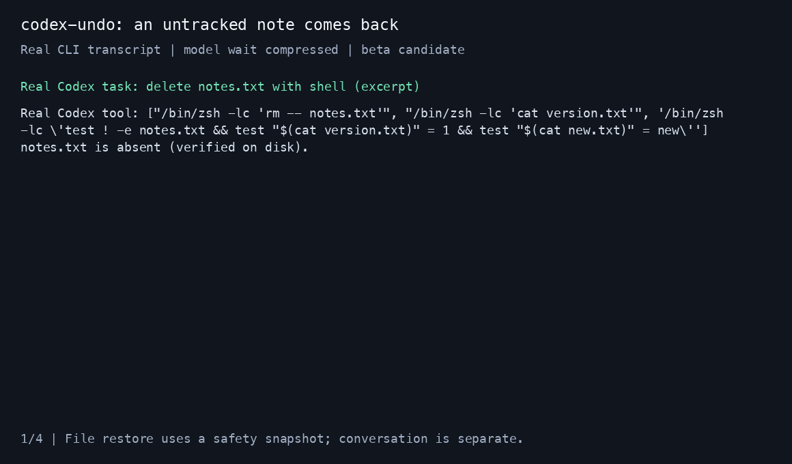

# codex-undo

[English](README.md)

**Codex 删了还没提交的文件？用已记录的检查点找回来，保留你的 Git 状态。**

一个 Rust 命令，通过官方 Codex hook 记录文件。恢复先预览冲突、自动保存安全
快照，再写回文件；`redo` 可以回到恢复前。

**v0.1 beta 候选版**：真实 CLI 十轮与删除恢复验证通过；万文件暖态性能目标通过，桌面版和十万文件目标仍未
完成验收。完整证据见 [验证记录](docs/VALIDATION.md)，不能把 schema 校验或
桌面捆绑 CLI 版本当成桌面版支持证据。



在克隆的源码目录里安装（Rust 1.97+）：

```sh
cargo install --locked --path .
codex-undo install
```

重启或恢复 Codex CLI，打开 **`/hooks`**，检查并信任新增 hook。执行第一轮后运行
`codex-undo status`，核实检查点确实被记录。安装器保留现有 remem、vibeguard
及其他 hook，修改前保存原始文件的精确备份；不会修改信任或审批设置。
GitHub Release、crates.io 和 Homebrew 尚未发布；仓库附有待审查的分发 workflow
与 HEAD Formula，不能据此声称线上安装渠道已可用。

## 日常使用

在项目根目录、所有 agent 停止写文件后运行：

```sh
codex-undo list
codex-undo diff 7
codex-undo undo              # 先预览并等待确认
codex-undo rewind 5          # 回到本地第 5 轮开始之前
codex-undo redo              # 回到最近一次恢复前的安全快照
codex-undo status
codex-undo gc                # 回收无引用对象，保留历史与恢复快照
```

当前内容或权限与已记录的预期不同，就是冲突；默认整次停止，不写任何文件。
审查预览后可显式加 `--force` 覆盖；`--yes` 只跳过确认，不放弃冲突保护。
即使强制覆盖，也会先持久化安全快照。确认期间发生的新修改会使执行拒绝。

一个目录存在多个会话时，用 `--session ID`；`status --all` 列出 ID。
如果 Codex shell 提供 `CODEX_THREAD_ID`，命令会用它选择会话。
这里的轮号是本地检查点编号，**未证明对应客户端回溯菜单编号**。
`!` 前缀仍未实测，已验证的操作方式是在另一个终端运行命令。

文件恢复不改变对话。下一条 UserPromptSubmit 会提醒模型重新读取相关文件；
对话分叉仍使用 Codex 自带界面，工具不声称两者已自动对齐。

## 跟踪范围与忽略规则

- 只读 Git index 中的可见文件，不执行 Git 子进程，不写 `.git`。
- `apply_patch` 明确声明的增加、修改、删除、移动路径，包括外部路径。
- 其他最近修改的 100 个可见文件，每个不超过 16 MiB；跳过依赖与构建目录。
  超过上限会报告覆盖缺口。
- 跟踪集合只增不减；新路径的第一次明确观测加入当前轮次的工具前基线。
  更早检查点没有观测它时，恢复会保留它。

隐藏文件默认跳过，直到被明确编辑。`.codexundoignore` 使用 gitignore 语法；
忽略的路径永远不快照、不恢复、不删除，undo/redo 都采用**操作开始时**的规则。
工作区外只按文件名匹配，如 `*.key`；工作区目录规则不描述外部目录。
快照与短消息摘要属于本地私密数据；先忽略不想记录的敏感文件。

结构化工具前只刷新其声明路径；shell/MCP 等不透明工具与轮次边界检查跟踪集合。
记录失败会尽可能留下缺口并放行，不输出阻止或继续对话的决定。
操作系统杀进程或 hook 超时可能来不及写警告；`status` 无法发现从未触发的轮次。

## 恢复安全与存储

只恢复记录过的普通、单硬链接文件。只有明确的“当时不存在”条目允许删除；
清单漏掉的路径始终保留。恢复先校验 blob，持久化安全快照和恢复意图，再用
临时文件、同步和原子重命名逐个写回，保留 rwx 权限和二进制内容。
中途失败后仍可 `redo`；整组文件不具备跨文件事务，恢复前必须停止其他写入者。

符号链接、包含链接的父路径、硬链接、目录与特殊文件会跳过，不恢复。
撤销新增文件后可能留下空目录。冲突检测识别内容差异，不能证明是谁改的。

默认存储位置：Linux 的 `~/.local/share/codex-undo/`、macOS 的
`~/Library/Application Support/codex-undo/`，设定 XDG_DATA_HOME 时优先使用它。
通过 `--data-dir` 或 `CODEX_UNDO_DATA_DIR` 可用隔离存储。
blob/manifest 采用 BLAKE3；会话是带校验的追加日志；跨进程锁覆盖 hook 与命令。
残缺日志尾部不破坏此前完整记录。stat 缓存比较 inode/device、大小、纳秒
mtime/ctime 与权限，近期指纹不可信时重算，恢复比较始终读取完整内容。
`gc` 保留历史和安全快照，仅清理无引用对象并清除相关缓存。

## 明确的限制

| 场景 | 状态 |
|---|---|
| 官方 CLI 0.160.0 | 十轮、未跟踪删除、undo/redo、第十轮撤销通过 |
| 子 agent | 实测父 session_id + 独立 turn_id/agent_id，归父当前轮 |
| fork | 实测 source=fork；输入没有父会话 ID，不能记录完整祖先关系 |
| interrupt | 实测活跃 shell 的 SIGINT 触发 Interrupt，最多 3 秒 timeout |
| 桌面版、`!`、Esc 菜单 | 未实测，不宣称支持 |
| shell/MCP 改工作区外文件 | 无观测；明确 apply_patch 外部路径可以记录 |
| 绕过 hook、新不透明文件 | 只能部分覆盖，不推断未知文件的不存在状态 |
| 并发会话 | 不合并历史，建议独立 worktree |
| split/sparse/SHA-256 Git index | 不支持或覆盖不完整，失败报告缺口 |
| 远程、云任务、Windows | 不在 v0.1 范围 |

[完整英文说明](README.md)包含测试命令、存储格式与分发流程。
[设计记录](docs/DESIGN.md)说明取舍。
[codex-rewind](https://github.com/extracurricular-ai/codex-rewind)有更完整的客户端
文件与对话集成，但需要修改版 CLI；本项目借鉴其公开正确性讨论，独立实现，
没有复制代码，并在此致谢。Claude Code 自带检查点；本工具专门针对官方 Codex。
本项目与 OpenAI 无隶属关系，MIT 许可。

## 卸载

```sh
codex-undo uninstall
cargo uninstall codex-undo
```

其他 hook、Codex 对话和 Git 保留。快照及配置备份继续保留，以便恢复；不再
需要历史时再手动删除。编译和测试不会注册全局 hook。
